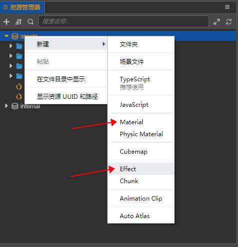
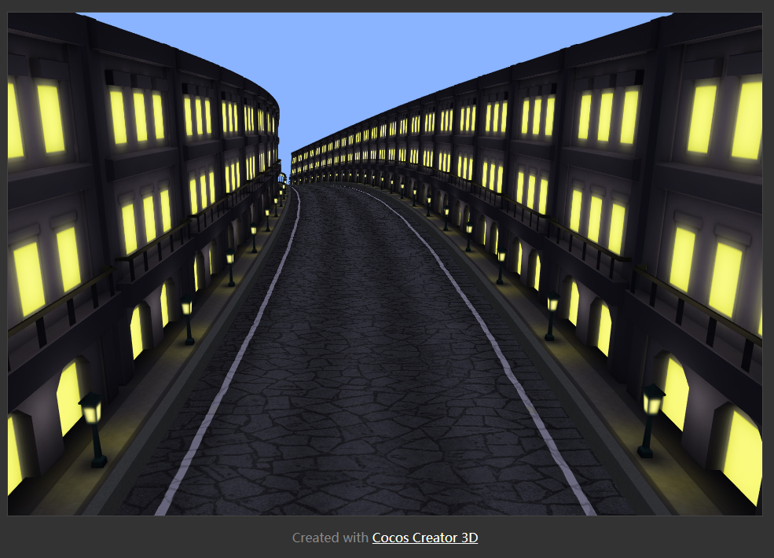

# 材质系统曲面效果实现分享

## 使用背景

在固定背后视角的跑酷游戏中，玩家面对的始终是前方布满障碍的赛道，除去有趣的障碍设计可以一直吸引玩家的注意外，许多游戏还会添加一些视觉效果使游戏看起来画面更有趣，比如今天我们要分享的这款《猪猪侠：极速狂飙》就采用了曲面的效果使得赛道看起来更多变，也更有立体感和纵深感。

那么，这样的效果在 Cocos Creator 3D 中是如何实现的呢？

## 实现方案分析

要实现曲面的效果，我们有几种方案可选择：

1. 直接使用曲面模型

   这种思路是最直观最容易想到的实现方案，从模型层面直接将效果做好，省去了其他处理，但这种方案也存在着很多严重的问题：
   - 模型复用不便，模型生成时的状态几乎决定了它的使用场合，这对于游戏开发中需要大量复用资源以减小包体来说有严重的问题。
   - 对于跑酷游戏这种物理需求并不复杂的游戏来说，大部分的游戏逻辑都可以直接通过计算直接完成而并不需要依赖物理引擎实现，对于正常的模型来说，规则的形状对于逻辑实现是很友好的，但是启用曲面模型就会对这种计算带来很多困难，几乎只能通过使用物理引擎来实现，过多的物理计算对性能是会有较大的影响的。

   包体不友好，性能不友好，异型模型还会对制作带来麻烦，对于只是为了实现显示效果来说，这些损耗得不偿失。

2. 使用材质系统实现

   我们需要明白一点，要实现的曲面的效果，实际上影响的只有显示效果，与其他的任何系统是不相关的，它不应当影响到其他无关的模块，既然只想改变显示，那采用材质系统来实现相较于采用曲面模型的方案有着诸多好处：
   - 不必使用物理引擎，简单的物理效果可以通过计算来实现，效率更优。
   - 模型可复用，想要实现不同的弯曲效果也很方便，只要使用带有曲面效果的不同参数的材质即可实现同一模型的不同效果。相较于方案一的多重模型来说，只需要几个材质即可解决问题。
   - 参数可配置，可以通过参数调节来得到不同的效果。

   分析看来，使用材质系统实现的方案相较直接使用曲面模型的方案来说，优势很明显，没有额外的开销，也没有太大的包体负担。

综上所述，使用材质系统实现更能满足我们的需求，所以我们采用材质系统来实现这个效果。

## 方案思路分析

从需求来看，我们是想要实现一个与我们的观察点相关的模型变形，既然只是变形，并不涉及到颜色的变化和处理，所以需要处理的就只有顶点着色器部分，而并不涉及片段着色器。
对于不太清楚渲染管线各个阶段的读者，可以参考 [LearnOpenGL](https://learnopengl.com/Getting-started/Hello-Triangle) 的渲染管线介绍。

在 shader 中，通过顶点着色器即可完成对模型顶点位置的操作。
明确了是对顶点位置进行操作后，我们将摄像机所在的点定为原点。由于我们的摄像机为固定在人物背后的，且赛道始终保持向 Z 轴负方向延伸，所以可以将模型与摄像机的 Z 轴方向的距离看作函数的输入值，想要得到曲面的效果，模型的点的变化规律如下：

- 距离原点越远的点产生的偏置值越大（函数在区间内为增函数）
- 距离原点越远的点偏置的变化速度越快（函数的导数为一次函数）
由上述两条规律不难得出，二次函数的变化规律与我们想要实现的曲面效果的规律契合，所以我们的顶点着色器的运算为一个关于顶点位置 Z 值的二次函数运算。

各位不难注意到，我们刚刚得出的规律是建立在一个特定空间下的，即以摄像机为原点的空间，这个空间正是空间变换中的观察空间阶段，所以我们之后对顶点的操作正是在这个空间中进行才能够得到正确的结果。

## 材质系统使用简介

我们的 Cocos Creator 3D 提供了完备的材质系统，基于这套材质系统我们能够很方便的在引擎中创建使用编辑材质，并且在场景预览窗口能够随时观察到材质更改所带来的变化。
在 Cocos Creator 3D 编辑器中与材质系统相关的资源有两种，分别为：

- Effect 资源，此类型资源为符合 Cocos Effect 语法标准的渲染流程描述文件，由 YAML 格式的流程控制清单和 基于 GLSL 300 ES 语法的 shader 片段共同组成。
- Material 资源，此资源可看做是 Effect 资源在场景中的资源实例，其本身除了 Effect 资源的引用外，还包括很多可配置参数以决定 Material 的状态。在实际使用中，我们的模型是需要使用 Material 资源的，这样就可以实现使用同一个 Effect 但参数不同以实现不同效果的需求了。

材质的使用也非常的方便，在 Cocos Creator 3D 编辑器的资源管理器中右键即可新建出 Effect 资源和 Material 资源



在 Material 资源可选择需要使用的 Effect 还可对其他参数进行配置，完成配置并保存后，选中需要使用材质的模型，选中需要的 material 或者直接将 material 拖入框中即可完成材质的设置


**具体详尽的材质介绍和参数表请参看我们的官方材质系统文档：[材质系统](https://docs.cocos.com/creator3d/manual/zh/material-system/overview.html)**

## 具体实现

思路已经清晰了，那么现在可以着手开始实现 shader 了

1. 启动 Cocos Creator 3D 编辑器（以下简称编辑器），为实验方便，使用最简单的场景即可，新建场景后，在场景编辑器中新建一个 Plane 模型，之后以此对象作为查看 shader 效果的对象。
2. 在编辑器的资源管理器中右键新建 Effect ，将其命名为 curved 或者符合要求的名字。
3. 这时新建的 Effect 文件为编辑器内置的 Effect 模板，其包含了最基础的 shader 结构，我们需要在这个基础上添加我们需要的功能，关于 Effect 的具体介绍请参看我们的材质 Effect 文档，在这里我只对我们需要的更改做出介绍。
4. 我们先来看 CCEffect 部分：

    ```
    CCEffect %{
      techniques:
      - name: opaque
        passes:
        - vert: general-vs:vert # builtin header
          frag: unlit-fs:frag
          properties: &props
            mainTexture:    { value: white }
            mainColor:      { value: [1, 1, 1, 1], editor: { type: color } }
      - name: transparent
        passes:
        - vert: general-vs:vert # builtin header
          frag: unlit-fs:frag
          blendState:
            targets:
            - blend: true
              blendSrc: src_alpha
              blendDst: one_minus_src_alpha
              blendSrcAlpha: src_alpha
              blendDstAlpha: one_minus_src_alpha
          properties: *props
    }%
    ```

    - 在默认的 Effect 模板中，我们需要更改的是 vert 字段所使用的 shader 片段，默认模板中提供的 general-vs:vert 是内置的顶点着色器，所以我们需要将其替换为我们即将实现的顶点着色器的名字（暂定为 unlit-vs）
    - 接下来需要对 properties 部分进行修改，property 列表将会将属性暴露在编辑器面板上方便我们的编辑和更改。
    - 此时，需要决定哪些数据是需要作为 uniform 传入 shader 中对效果做出影响的了，结合之前分析的需求：
    - 需要有一个决定模型点在各个分量轴上偏置值的偏置位置信息，我们使用一个 vec4 来存储这个偏置值（allOffset）
    - 需要有一个决定偏置变化的系数的值，使用一个 float 即可（dist）
    - 还可以添加模型的主贴图等（mainTexture）
    - 经过以上更改之后，我们的 Effect 的 CCEffect 部分看起来是这个样子的：

      ```
      CCEffect %{
        techniques:
        - name: opaque
          passes:
          - vert: unlit-vs:vert
            frag: unlit-fs:frag
            properties: &props
              mainTexture:  { value: grey         }
              allOffset:    { value: [0, 0, 0, 0] }
              dist:         { value: 1            }
        - name: transparent
          passes:
          - vert: unlit-vs:vert
            frag: unlit-fs:frag
            depthStencilState:
              depthTest: true
              depthWrite: false
            blendState:
              targets:
              - blend: true
                blendSrc: src_alpha
                blendDst: one_minus_src_alpha
                blendDstAlpha: one_minus_src_alpha
            properties: *props
      }%
      ```

5. 由于默认的 Effect 模板中使用了内置的顶点着色器，所以这里我们需要实现自己的顶点着色器，可以参考内置的 builtin-unlit 的实现来编写此段 shader：

    - 添加我们需要的 uniform ：

      ```
          uniform Constants {
              vec4 allOffset;
              float dist;
          };
      ```

    - 编写入口函数：vert
    - 按照引擎要求对接骨骼动画和数据解压，直接在开头调用 CCVertInput 工具函数
    - 模型资源在场景中可能出现很多重复的，这样就需要对模型进行动态合批，对接引擎的动态合批流程，在包含 cc-local-batch 头文件后，通过 CCGetWorldMatrix 函数获取世界矩阵

      ```
          vec4 position;
          CCVertInput(position);

          highp mat4 matWorld;
          CCGetWorldMatrix(matWorld);
      ```

    - 在分析时提到需要在观察空间下对顶点进行处理，所以需要将坐标转换到观察空间下
    - 我们的曲面效果是和我们的 Z 坐标直接相关的，所以系数也是直接影响Z坐标的
    - dist 系数由于为影响变化的系数，所以在和 vpos.z 的运算时可以使用乘法也可以使用除法，但这个改变 **会直接影响 dist 的取值** 所以在决定是使用除法还是乘法后需要对值进行对应修改，且注意使用除法时 dist 的值不可为 0
    - 对于各轴分量的修改，此时需要 allOffset 参与运算然后造成影响，此处的 zOff 的平方运算即为分析中的二次函数符合变化规律的实现
    - 在处理完之后，按照正常的变换逻辑继续将观察空间通过投影矩阵变换为裁剪空间下的坐标之后继续传递给片段着色器即可

      ```
          highp vec4 vpos = cc_matView * matWorld * position;
          highp float zOff = vpos.z / dist;
          vpos += allOffset * zOff * zOff;
          highp vec4 pos = cc_matProj * vpos;

          v_uv = a_texCoord;
          return pos;
      ```

6. 对于片段着色器，我们并未做特殊的操作，所以直接使用默认提供的就可以

7. 所以，最终的 effect 如下：

    ```
    CCEffect %{
      techniques:
      - name: opaque
        passes:
        - vert: unlit-vs:vert
          frag: unlit-fs:frag
          properties: &props
            mainTexture:  { value: grey         }
            allOffset:    { value: [0, 0, 0, 0] }
            dist:         { value: 1            }
      - name: transparent
        passes:
        - vert: unlit-vs:vert
          frag: unlit-fs:frag
          depthStencilState:
            depthTest: true
            depthWrite: false
          blendState:
            targets:
            - blend: true
              blendSrc: src_alpha
              blendDst: one_minus_src_alpha
              blendDstAlpha: one_minus_src_alpha
          properties: *props
    }%

    CCProgram unlit-vs %{
      precision highp float;
      #include <cc-global>
      #include <cc-local-batch>
      #include <input>

      in vec2 a_texCoord;
      out vec2 v_uv;

      uniform Constants {
        vec4 allOffset;
        float dist;
      };

      highp vec4 vert () {
        vec4 position;
        CCVertInput(position);

        highp mat4 matWorld;
        CCGetWorldMatrix(matWorld);

        highp vec4 vpos = cc_matView * matWorld * position;
        highp float zOff = vpos.z / dist;
        vpos += allOffset * zOff * zOff;
        highp vec4 pos = cc_matProj * vpos;

        v_uv = a_texCoord;
        #if FLIP_UV
          v_uv.y = 1.0 - v_uv.y;
        #endif
        return pos;
      }
    }%

    CCProgram unlit-fs %{
      precision highp float;
      #include <output>

      in vec2 v_uv;
      uniform sampler2D mainTexture;

      vec4 frag () {
        vec4 o = vec4(1, 1, 1, 1);

        o *= texture(mainTexture, v_uv);

        return CCFragOutput(o);
      }
    }%
    ```

8. 在完成了 effect 之后，我们可以在编辑器中新建一个材质，在材质的 Effect 中选择刚刚完成的 curved 之后传入想要的贴图，填入 dist 和 AllOffset 参数，保存之后将这个材质赋予刚刚提到的 plane 对象，调整参数可以看到我们的片面就能出现偏置效果了，移动摄像机可看到偏置效果是与顶点距离摄像机的距离相关的：

9. 请注意，shader 的参数与模型的尺寸是相关的，上图所示效果是在 dist 为 100，AllOffset 的 Y 值为 10 时的效果，可尝试不同的组合来达到想要的效果
10. 似乎上图的效果还不是太直观，所以我用一些建筑模型和一些路面模型简单搭建了一段赛道来模拟游戏可能会出现的场景。建议最好是能够显示出纵深效果的连续模型段，更能显示出效果，当然这个效果并不只限于Y轴方向，还可以同时满足X轴方向的偏置需求，下图所示即为Dist 为 100，X 为 -20，Y 为 -10 时的效果图：


## 总结

相信各位对 [ShaderToy](https://www.shadertoy.com/) 并不陌生，之后，我们将提供从 ShaderToy 中迁移 shader 的方法，海量 shader 等你来学习！目前在我们的[官方案例仓库](https://github.com/cocos-creator/example-3d)的 demo02 中，已经实现了一个迁移好的场景案例(ShaderToy)，感兴趣的小伙伴们赶快去试试吧！

在我们的社区中，也有小伙伴分享了很多炫酷的材质效果，感谢 @yans 做出的分享，欢迎大家来[围观](https://forum.cocos.org/users/yans/activity)，有想法的小伙伴也欢迎多做分享。

以上就是今天带来的材质系统的简单使用案例分享，希望通过这个简单的案例能够为各位提供一个了解材质系统的入口，材质系统功能十分丰富，能够实现的效果也是多种多样的，各位快快打开脑洞，用 Cocos Creator 3D 来实现各种炫酷的效果吧！在创作过程中的问题和经验，欢迎各位在 Cocos 中文社区中与我们交流！
